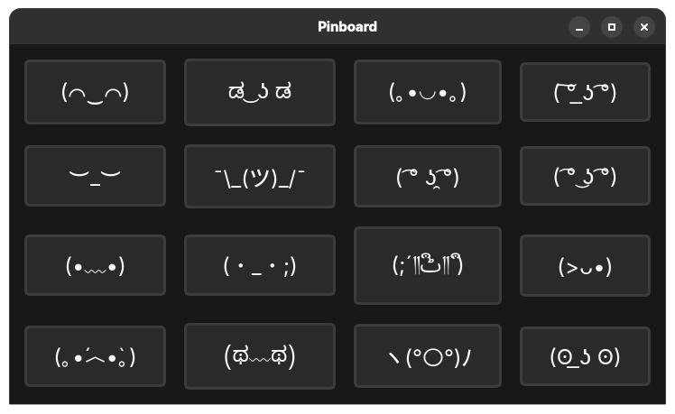

## Pinboard

A Qt6 program to copy paste from a preconfigured set of texts. Designed to be assigned to a keyboard shortcut such as SHIFT + ALT + V. Customize the pins by editing the pins.json file (should be in the same directory as the executable).

### Usage

| Keys           | Function                                       |
|----------------|------------------------------------------------|
| H, J, K, L     | Navigate                                       |
| Arrow Keys     | Navigate                                       |
| Enter or Space | Copy the highlighted item and quit the program |
| Esc or Q       | Quit the program                               |

### Screenshot

### License

GNU General Public License v3 or later.

### Old version

See https://github.com/yusacetin/pinboard_gtk for the old GTK version.